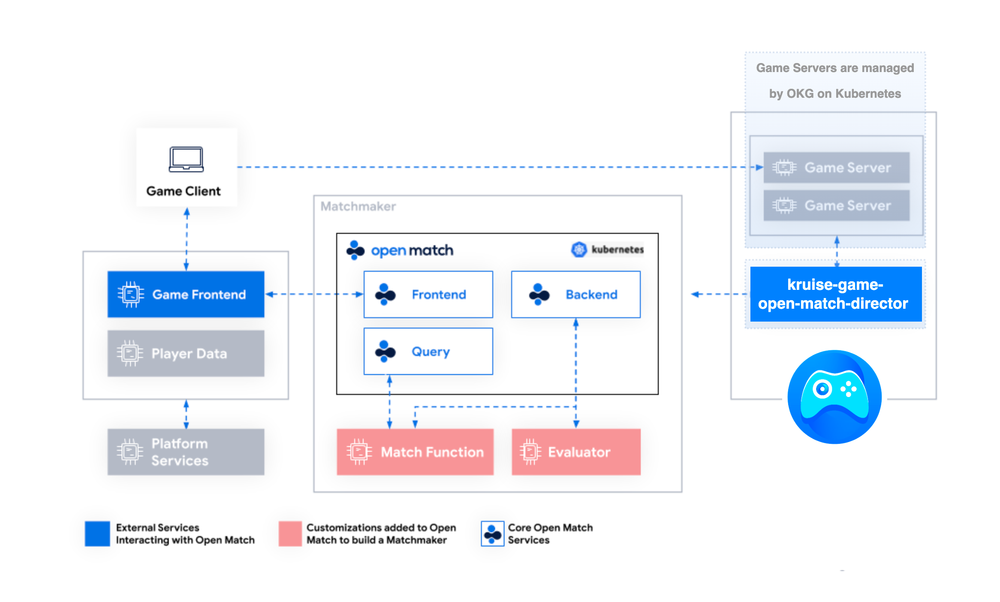

## kruise-game-open-match-director

### Overview

**kruise-game-open-match-director** allocate appropriate game servers managed by OpenKruiseGame for players, which actually is a director component based on [open-match framework](https://open-match.dev/site/).

**kruise-game-open-match-director** is located between the Game Servers and the Backend of open-match. As shown in the figure, it will perceive the network information and running status of the game server in the cluster, and when a matching request comes, it will find a game server that meets the needs of the players and return the corresponding network access address.




### Parameter Description

```yaml
        command:
        - '/director'
        - '--lease-lock-name=kruise-game-open-match-director'
        - '--lease-lock-namespace=open-match-demo'
        - '--match-function-endpoint=om-function.open-match-demo.svc.cluster.local'
        - '--match-function-port=50502'
        - '--gss-names=flappy-bird'
```

- gss-names
  - The names of the GameServerSets that you want to put in pool. 
  - Usually each GameServerSet represents a game. If you want to make players get into different games, you can fill in multiple names, which are separated by ','. For example: football,basketball
  - And you can create a ticket with `game_name` to choose which game the player should join in. The tickets would be like this:
      ```yaml
      &pb.Ticket{
          SearchFields: &pb.SearchFields{
              StringArgs: map[string]string{
                  "game_name": "football", # the same as the gss name that is already register in one of the match pools. This player will join in football game.
              },
          },
        } 
      &pb.Ticket{
          SearchFields: &pb.SearchFields{
              StringArgs: map[string]string{
                  "game_name": "basketball", # the same as the gss name that is already register in one of the match pools. This player will join in basketball game.
              },
          },
        } 
    ```
  - you can also design different match functions for different games, and use the game_name to distinguish each one. Director will generate two MatchProfiles in this examples, which are:
    ```yaml
      p := []*pb.MatchProfile{
          {
              Name: "football",
              Pools: []*pb.Pool{
                  {
                      Name: "game_name",
                      StringEqualsFilters: []*pb.StringEqualsFilter{
                          {
                              StringArg: "game_name",
                              Value:     "football",
                          },
                      },
                  },
              },
          },
          {
              Name: "basketball",
              Pools: []*pb.Pool{
                  {
                      Name: "game_name",
                      StringEqualsFilters: []*pb.StringEqualsFilter{
                          {
                              StringArg: "game_name",
                              Value:     "basketball",
                          },
                      },
                  },
              },
          },
      }
    ```

- profile-name
  - The default profile name without any filters. Default value is 'default'.
  - When you want to rewrite the profile name of Match object in match function, you should set it as the name you rewrite.
  - It is recommended not to change this value, just use & not rewrite the defined profile name by director in the match function, which is 'default'.
 